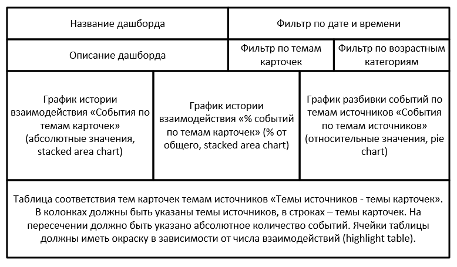

# Создание дашборда Tableau для Яндекс.Дзен

Ссылка на интерактивный дашборд на сайте [Tableau Public](https://public.tableau.com/views/__16858683467840/Dashboard1?:language=en-US&publish=yes&:display_count=n&:origin=viz_share_link)

## Описание:
Вы работаете аналитиком в Дзене. Для коллег нужно сделать дашборд. Он будет основан на пайплайне, который будет брать данные из таблицы, в которых хранятся сырые данные, трансформировать данные и укладывать их в агрегирующую таблицу dash_visits.csv. 

## Данные

Информация содержится в базе данных. Для подключения к ней и выгрузки данных в csv-файл необходимо подготовить и запустить код в [Connection_file.ipynb](https://github.com/FreckleFoxMitch/Yandex_projects_DA/blob/main/10.%20%D0%94%D0%B0%D1%88%D0%B1%D0%BE%D1%80%D0%B4%20Tableau%20%D0%B4%D0%BB%D1%8F%20%D0%AF%D0%BD%D0%B4%D0%B5%D0%BA%D1%81.%D0%94%D0%B7%D0%B5%D0%BD/10.db_connect.ipynb)

## Краткое ТЗ

Проанализировать взаимодействие пользователей с карточками Яндекс.Дзен и ответить на вопросы:
* Сколько взаимодействий пользователей с карточками происходит в системе с разбивкой по темам карточек?
* Как много карточек генерируют источники с разными темами?
* Как соотносятся темы карточек и темы источников?

**Состав данных для дашборда:**
* История событий по темам карточек (два графика - абсолютные числа и процентное соотношение);
* Разбивка событий по темам источников;
* Таблица соответствия тем источников темам карточек.

**По каким параметрам данные должны группироваться:**
* Дата и время;
* Тема карточки;
* Тема источника;
* Возрастная группа;
* 

**Источник данных для дашборда - агрегирующая таблица dash_visits. Вот её структура:** 
* record_id — первичный ключ,
* item_topic — тема карточки,
* source_topic — тема источника,
* age_segment — возрастной сегмент,
* dt — дата и время,
* visits — количество событий.

## Используемые библиотеки

`pandas`, `sqlalchemy`

## Статус проекта

Завершен
